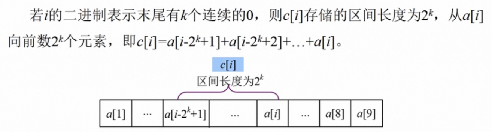

## 树状数组

1. 树状数组

   1. 图示：

      

   2. 定义：二进制索引数组，通过二进制分解划分区间

   3. 区间长度：c[x]管理的区间长度可以用lowbit(x)计算

      

   4. 前驱与后继：

      

   5. 操作：

      **对于原数组中每个节点，在树状数组中均会有与之对应的一个节点，只是存储和管理的元素值是当前节点向前的一段**

      1. 点更新：将原数组中某个位置的数加上特性值value，相当于将树状数组中对应位置的节点及其全部后继节点均加上value。从叶子到树根，执行更新的次数不超过树的高度O(logn)
      2. 前缀和与区间和查询：计算从当前节点向前的所有节点的元素总和，相当于将在树状数组中一直查找当前节点对应的前驱并将和相加，前驱的个数不超过O(logn)

      ```java
      int[] tr; //tr数组下标从1开始存储 tr[i]对应nums[i-1]
      int[] nums;
      
      //针对tr数组的操作add query
      int lowbit(int x){
          return x&(-x);
      }
      
      void add(int x, int v){
          for(int i = x; i <= nums.length; i+=lowbit(i)) tr[i]+=v;
      }
      
      int query(int x){
          int res = 0;
          //注意这里不能有= 因为 0-lowbit(0)=0 无法跳出循环
          for(int i = x; i > 0; i-=lowbit(i)) res+=tr[i];
          return res;
      }
      
      //针对nums数组的操作
      //更新：将原数组中index的位置的值更新成val，将tr[index+1]及其所有后继均加上val-nums[index]
      void update(int index, int val){
          add(index+1, val-nums[index]);
          nums[index] = val;
      }
      
      //计算区间和：原数组中left-right的元素和
      int sumRange(int left, int right){
           return query(right+1) - query(left+1-1);
      }
      
      //初始化
      public NumArray(int[] nums){
          n = nums.length;
          tr = new int[nums.length+1];
        	for (int i = 0; i <= n; i ++) {
          		add(i+1, nums[i]);
      		}
      }
      ```

   6. 模版题：leetcode 307 区域和检索-数组可变化


2. leetcode 315 计算右侧小于当前元素的元素个数

   1. 题目：给你一个整数数组 `nums` ，按要求返回一个新数组 `counts` 。数组 `counts` 有该性质： `counts[i]` 的值是 `nums[i]` 右侧小于 `nums[i]`的元素的数量。

   2. 范围：`1 <= nums.length <= 10` `-104 <= nums[i] <= 104`

   3. 代码：

      ```java
      int[] tr;
      
      int lowbit(int x){
          return x & (-x);
      }
      
      void add(int x, int v){
          for(int i = x; i < tr.length; i+=lowbit(i)) tr[i] += v;
      }
      
      int query(int x){
          int res = 0;
          for(int i = x; i > 0; i-=lowbit(i))  res += tr[i];
          return res;
      }
      
      public List<Integer> countSmaller(int[] nums) {
          //在树状数组tr中 用index表示nums[i] tr[index]表示值为nums[i]的元素个数
          //在将nums[i]插入树状数组的过程中不断计算query(nums[i]-1)即相当于求所有小于等于nums[i]-1的元素个数
          //由于要求的是右侧的元素 因此nums的遍历从右往左进行
          //由于tr的下标从1开始 nums[i]的取值范围为-10000 ～ 10000 需要将nums[i]+10001映射到从1开始
          tr = new int[20002];
          int[] r = new int[nums.length];  //先用数组记录而不是直接插入链表中否则会超时
          List<Integer> res = new ArrayList<>();
          for(int i = nums.length-1; i >= 0; i--){
              int tmp = nums[i] + 10001; //tmp [1, 20001]
              r[i] = query(tmp-1); //query(x)求的是所有小于等于x的元素个数
              add(tmp, 1);  //将个数+1(初始化)
          }
          for(int x : r){
              res.add(x);
          }
          return res;
      }
      ```

      

3. leetcode 327 区间和的个数

   1. 题目：给你一个整数数组 `nums` 以及两个整数 `lower` 和 `upper` 。求数组中，值位于范围 `[lower, upper]` （包含 `lower` 和 `upper`）之内的 **区间和的个数** 。**区间和** `S(i, j)` 表示在 `nums` 中，位置从 `i` 到 `j` 的元素之和，包含 `i` 和 `j` (`i` ≤ `j`)。

   2. 范围： `1 <= nums.length <= 105` `-231 <= nums[i] <= 231 - 1` `-105 <= lower <= upper <= 105`

   3. 题目数据保证答案是一个 **32 位** 的整数

   4. 代码：可以利用 **hashset + 数组 + 二分 /  hashset + hashmap** 进行离散化

      ```java
      int[] tr; //下标对应离散化数组中的下标+1 存储的是数的个数 tr[i+1] = j (x的个数)
      long[] numbers;  //离散化后的元素数组 numbers[i] = x
      
      int lowbit(int x){ return x & (-x); }
      void add(int x, int y){
          for(int i = x; i < tr.length; i+=lowbit(i)) tr[i] += y;
      }
      int query(int x){
          int res = 0;
          for(int i = x; i > 0; i-=lowbit(i)) res += tr[i];
          return res;
      }
      
      //从离散化数组中找到原查询位置对应的下标
      int get(long x){
          int l = 0;
          int r = numbers.length-1;
          while(l < r){
              int mid = (l+r)/2;
              if(numbers[mid] >= x){ r = mid; }
              else{ l = mid + 1;  }
          }
          return l + 1; //此处+1的原因是tr中的数据是从下标1开始存储的 numbers中是从0开始存储的
      }
      
      public int countRangeSum(int[] nums, int lower, int upper) {
          //对于区间终点i 枚举[j,i] 计算其是否满足[lower upper]
          // lower <= sum[i] - sum[j-1] <= upper
          // sum[i]- upper <= sum[j-1] <= sum[i] - lower
          //相当于求 a = sum[i]- upper b = sum[i] - lower之间的元素个数
          //等于 query(b) - query(a-1)
          //则需要将所有的a-1 b sum[x]先全部计算出来并进行离散化，再进行计算
      
          //1.利用hashset+二分查找进行离散化
          //对于每个数计算sum并且添加三个值到hashset中
          HashSet<Long> set = new HashSet<>();
          set.add((long)0); //前缀和s[0]=0
          long[] sum = new long[nums.length+1]; 
          for(int i = 1; i <= nums.length; i++){
              sum[i] = sum[i-1] + nums[i-1];
              set.add(sum[i]);
              set.add(sum[i]-upper-1);
              set.add(sum[i]-lower);
          }
          numbers = new long[set.size()];
          int idx = 0;
          for(long t : set){
              numbers[idx++] = t;
          }
          Arrays.sort(numbers);
      
          //利用树状树组边插入边查询
          tr = new int[numbers.length+1]; //并不是所有位置都有值 有的只是查询位置
          int res = 0;
          add(get(sum[0]), 1);
          for(int i = 1; i < sum.length; i++){
              res += query(get(sum[i] - lower)) - query(get(sum[i] - upper -1));
              add(get(sum[i]), 1); 
          }   
          return res;
      }
      ```
      
      